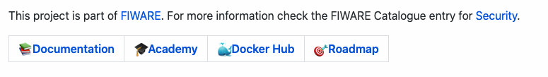

# General Requirements

<span style="color:#233c68;">&#x24D5;</span> A FIWARE GE **MUST** fit well in the architecture of a _“Powered by
FIWARE”_ solution:

-   Integrate well with architectures where context management is cornerstone and addressed using FIWARE NGSI (currently
    FIWARE NGSIv2, compliant with ETSI NGSI-LD in the future).
-   Be able to fit within one of the defined FIWARE chapters.

## Licensing and IPR Management

<a style="color:red!important" href="https://bestpractices.coreinfrastructure.org/en/projects/1#floss_license">&#x24D2;</a>
The source code of the product MUST be licensed under
[one of the well-recognized open source licenses approved by the Open Source Initiative](https://opensource.org/licenses/alphabetical).

<a style="color:red!important" href="https://bestpractices.coreinfrastructure.org/en/projects/1#license_location">&#x24D2;</a>
The open source license under which source code of the product is licensed **MUST** be clearly mentioned in a
first-level section of the `README.md` file included in the main GitHub repository. When using a copyleft open source
license, the following paragraph **MUST** be added in the section where the open source license is mentioned:

> Please note that software derived as a result of modifying the source code of the <name-of-product> software in order
> to fix a bug or incorporate enhancements IS considered a derivative work of the product. Software that merely uses or
> aggregates (i.e. links to) an otherwise unmodified version of existing software IS NOT considered a derivative work.

<a style="color:red!important" href="https://bestpractices.coreinfrastructure.org/en/projects/1#enhancement_responses">&#x24D2;</a>
Every enabler **MUST** be open to third party contributions. All offered contributions **MUST** be reviewed within a
"reasonable" timeframe.

<a style="color:red!important" href="https://bestpractices.coreinfrastructure.org/en/projects/1#dco">&#x24D2;</a> There
**MUST** be a document (`CONTRIBUTIONS` guidelines) clearly describing the terms under which the IPR of contributions to
the source code of the product will be managed. Such document **MUST** be made accessible in (or map to) a first-level
section of the `README.md` file included in the associated GitHub repositories.

When using a copyleft open source license, IPR Management rules for contributions **MUST** include clauses as follows:

-   There should be at least one organization which can exercise IPRs on the whole software.
-   There is a commitment to transfer to the FIWARE Foundation the IPRs on the whole software in case that the software
    is not longer supported by the organization(s) that currently own(s) IPR on the whole software.

## SCM Tool

<a style="color:red!important" href="https://bestpractices.coreinfrastructure.org/en/projects/1#repo_public">&#x24D2;</a>
The SCM Tool **MUST** be [github.com](https://github.com). Accompanying tools or plugins that integrate well with GitHub
(ex. Gerrit) **MAY** be used.

<a style="color:red!important" href="https://bestpractices.coreinfrastructure.org/en/projects/1#repo_interim">&#x24D2;</a>
GitHub **MUST** be used during the **whole development lifecycle**. See
[Development Lifecycle Recommendations in FIWARE](lifecycle.md) which describes a set of best practices for
collaborative open source development.

Additionally, refer to the [checklist for publishing FIWARE Generic Enablers](GE_Checklist.md) for a list of onboarding
tasks to be completed in order to publish a new GE.

## `README.md`

<a style="color:red!important" href="https://bestpractices.coreinfrastructure.org/en/projects/1#description_good">&#x24D2;</a>
A `README.md` **MUST** be always present in the root folder of any repository associated to the GE. The purpose of such
a document associated to a GE is to document: - GE overall description. - How to Deploy the GE (basic/default
installation procedure) - How to run tests - A walkthrough guide on using the main APIs - How to get access to the
advanced API and Documentation topics

In general the structure of the `README.md` **SHOULD** follow a standard format such as
[standard-readme](https://github.com/RichardLitt/standard-readme).

<a style="color:red!important" href="https://bestpractices.coreinfrastructure.org/en/projects/1#documentation_basics">&#x24D2;</a>
The `README.md` file of the GitHub repository must start by summarizing the usage of the enabler (for example
duplicating the elevator pitch)

<span style="color:#233c68;">&#x24D5;</span> The `README.md` file **MUST** include an Introduction/About section at the
beginning which includes the following paragraph, introducing FIWARE, clearly showing that the product has been labeled
as a FIWARE GE:

```markdown
This project is part of [FIWARE](https://www.fiware.org/). For more information check the FIWARE Catalogue entry for
[<chapter>](https://github.com/Fiware/catalogue/tree/master/<chapter>).
```

### General

<span style="color:#233c68;">&#x24D5;</span> The `README.md` file **MUST** include the
[Project Badges](project_badges.md) which are stated as mandatory.

<a style="color:red!important" href="https://bestpractices.coreinfrastructure.org/en/projects/1#documentation_roadmap">&#x24D2;</a>
links to proper places on the FIWARE site (or related repositories) where planned roadmap of the product with respect to
future releases of FIWARE is described (see sections on Releases and Roadmap below).

<span style="color:#233c68;">&#x24D5;</span> More specifically, the referred `README.md` **SHOULD** follow
standard-readme and include:

-   <a style="color:red!important" href="https://bestpractices.coreinfrastructure.org/en/projects/1#description_good">&#x24D2;</a>
    Simple GE/Service **Description** and purpose -

    -   The first paragraph **SHOULD** be an **elevator pitch** about the purpose of the repository (Since this is
        displayed on GitHub on mobile)
    -   Include direct **ReadtheDocs** links to the **User Guide**, **Admin Guide** in a subsequent introductory
        paragraph (To allow users to navigate directly between code and documentation )
    -   Include information about testbed environments if available

-   Then add a **Table of Contents** to make navigation through the rest of the document easier

-   <a style="color:red!important" href="https://bestpractices.coreinfrastructure.org/en/projects/1#build">&#x24D2;</a>
    How to **Build & Install**

    -   Make your simplest full stack deployment as easy as possible
    -   Include System requirement info: SO, CPU/Storage Capacity...
    -   Include installation support for your dependencies
    -   Provide a “Hello World” example using curl (basic acceptance test)
    -   Include troubleshooting information for the whole process

-   <a style="color:red!important" href="https://bestpractices.coreinfrastructure.org/en/projects/1#documentation_interface">&#x24D2;</a>
    **API Overview** of the main data flow

    -   It is a tutorial, not a reference. It does not need to be exhaustive, it needs to guide the user
    -   Provide always curl examples for this section

-   <a style="color:red!important" href="https://bestpractices.coreinfrastructure.org/en/projects/1#documentation_interface">&#x24D2;</a>
    More **API Examples**

    -   Just the important bits of your API used in examples

-   A link to the **API Reference Documentation**. [Open API](https://github.com/OAI/OpenAPI-Specification) **SHOULD**
    be used.

-   <a style="color:red!important" href="https://bestpractices.coreinfrastructure.org/en/projects/1#test_invocation">&#x24D2;</a>
    How to **run tests**

    -   End-to-end tests (**SHOULD**). This will be part of the sanity checks included in the "Installation &
        Administration Guide", thus a link will be needed.
    -   Unit tests (**SHOULD**)
    -   Performance tests (**MAY**)

-   List of links to **Advanced topics** (/doc folder)
    -   User & Programmers Manual (**MUST**)
    -   Installation & Administration Guide (**MUST**)
    -   Other documents, for instance: HA deployment, detailed architecture, Advanced configuration topics, advanced
        functionalities, ...

### Quality Assurance

<span style="color:#233c68;">&#x24D5;</span> a section within the `README` **SHOULD** display the GE ratings defined in
the [template](GE_roadmap_template.md).

### Tutorials/Training

<span style="color:#233c68;">&#x24D5;</span> GE's repository `README.md` file **MUST** include a linkbox of relevant
training courses:



As an example, in Markdown adding links to learning materials as shown:

```markdown
| [Documentation] | [Academy] | ...etc |
```

## Functional Testing

<a style="color:red!important" href="https://bestpractices.coreinfrastructure.org/en/projects/1#test">&#x24D2;</a> A
FIWARE GE **MUST** include a suite of functional tests that allow to verify the proper integration with the FIWARE
Context Broker GE.

## Commitment to Quality

<span style="color:#233c68;">&#x24D5;</span> The Community behind each FIWARE GE (owner, other contributors) **SHOULD**
bring support to requests submitted through standard [FIWARE Help Desk channel](mailto:fiware-help@lists.fiware.org) and
QA testings executed by QA Lab team.

The following assessments will be conducted:

-   Assessment on support, to be performed by automated monitoring tools defined by the FIWARE Foundation.
-   Assessment on functionality, (sw and documentation), non-functional requirements, etc. to be performed by the FIWARE
    QA Lab team.

Results of these assessments lead to the assignment of a QA label based on
[FIWARE QA labeling schema](https://www.fiware.org/wp-content/uploads/2016/10/QA_public_document.pdf) . QA labels of a
given FIWARE GE will always be associated to a minor release of FIWARE. In the event of not meeting the minimal QA
requirements:

-   **Yellow card** reprimand will be issued when overall QA label is **B** or lower.
-   **Red card** reprimand when overall QA label is **C** or lower or keeps being **B** in two consecutive minor
    releases of FIWARE.

## Software Releases

GE Owners can release their software at their own release schedule:

<a style="color:red!important" href="https://bestpractices.coreinfrastructure.org/en/projects/1#version_semver">&#x24D2;</a>
the codebase **MUST** be tagged with a semantic release number

<a style="color:red!important" href="https://bestpractices.coreinfrastructure.org/en/projects/1#version_unique">&#x24D2;</a>
Every release **MUST** have a unique version number

<a style="color:red!important" href="https://bestpractices.coreinfrastructure.org/en/projects/1#release_notes">&#x24D2;</a>
Every GE release MUST have an associated Release Notes entry at the GitHub Releases section.

As an example see the following [release note](https://github.com/telefonicaid/fiware-orion/releases)

## FIWARE Catalogue Releases

Periodically the FIWARE Foundation will annouce a catalogue release, every time there is a FIWARE Release:

<span style="color:#233c68;">&#x24D5;</span> GE Owners **MUST** tag the GE release pertaining to such FIWARE Release
with `FIWARE_<major>.<minor>`. Please note that this imply that certain GE releases could be double tagged. The referred
tag will be intended to mark clearly that such GE Release is part of and compatible with the corresponding FIWARE
Release. Docker images or other associated artefacts **MUST** also be properly tagged with the referred FIWARE tag.

"Compatibility" with a release means compatibility with the FIWARE Context Broker in that release, i.e. the FIWARE GE
owner commits to do the relevant functional and integration testing. This also implies that breaking changes within the
Context Broker should be scheduled and announced beforehand (i.e. roadmapped) to give GEs a chance to catch up.

A "FIWARE Release" shall contain versioned releases of all Generic Enablers found within the
[catalogue](https://www.fiware.org/developers/catalogue/). All GEs pertaining to a FIWARE Release must work seamlessly
with the version of the [Context Broker](https://github.com/telefonicaid/fiware-orion) corresponding to that FIWARE
Release.

The following rules apply for numbering FIWARE Releases:

-   Major release number: to be increased by decision at TSC level, typically linked with a major achievement (e.g.,
    support to NGSI-LD).
-   Minor release number: to be incremented with relevant milestones agreed at TSC level. Milestones will be usually
    aligned with the celebration of FIWARE Summits. Additional releases can be added if strictly needed and agreed at
    TSC level.

## Project Roadmap

<a style="color:red!important" href="https://bestpractices.coreinfrastructure.org/en/projects/1#documentation_roadmap">&#x24D2;</a>
A FIWARE GE **MUST** describe its planned roadmap. A link to the roadmap **MUST** be found in the `README.md`

<span style="color:#233c68;">&#x24D5;</span> For describing a GE roadmap the following template **MUST** be used:
[GE_roadmap_template.md](GE_roadmap_template.md)

<span style="color:#233c68;">&#x24D5;</span> Representatives of the GE community **MUST** attend F2F roadmap meetings to
take place at FIWARE Summits (not overlapping with agenda, day or day and a half before the Summit or after the Congress
part)

There will be a web page on the FIWARE site describing what overall work is planned.
