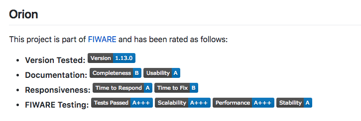
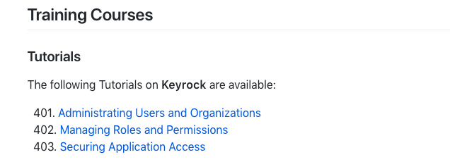
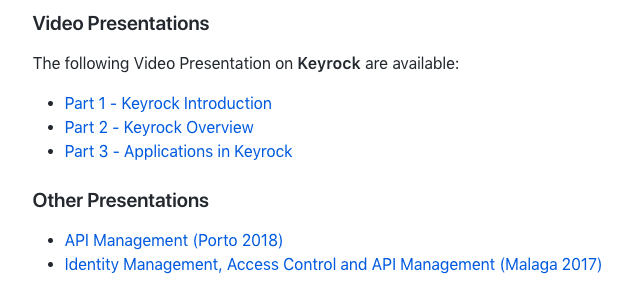

# General Requirements

A FIWARE GE **MUST** fit well in the architecture of a _“Powered by FIWARE”_
solution:

-   Integrate well with architectures where context management is cornerstone
    and addressed using FIWARE NGSI (currently FIWARE NGSIv2, compliant with
    ETSI NGSI-LD in the future).
-   Be able to fit within one of the defined FIWARE chapters.

## Development Lifecycle Requirements

The following requirements govern the development lifecycle:

-   Direct commits or self-commits to the master branch are not allowed. All
    contributions to master **MUST** come in the form of a Pull Request.
-   Pull Requests **MUST** include not only code changes but also test changes
    and documentation changes.
-   Pull Requests **MUST** be public and open during a reasonable period of time
    so that the community can check them and contribute if necessary.
-   Pull Requests need to be approved (using the standard GitHub function or a
    'LGTM' comment) by all the reviewers involved, i.e. all people that gave
    their feedback on it. Nonetheless, if a PR has been approved by at least one
    reviewer, and after a reasonable time for feedback no further comments have
    been received, the approved Pull Request should be landed as-is.
-   Pull Request approval **MUST** be issued by a third party. Nobody can
    auto-merge their contributions.
-   Before merging an open Pull Request Travis status **MUST** be green.

## Testing Requirements

A FIWARE GE **MUST** include a suite of functional tests that allow to verify
the proper integration with the FIWARE Context Broker GE.

## Publication Requirements

-   The SCM Tool **MUST** be [Github.com](https://github.com).
-   GitHub **MUST** be used during the **whole development lifecycle**. See
    [Development Lifecycle Recommendations in FIWARE](development.md#Development_Lifecycle)
    which describes a set of best practices for collaborative open source
    development.
-   See [Checklist for publishing FIWARE Generic Enablers](GE_Checklist.md) for
    a list of tasks to be done in order to publish a new GE.

## Documentation Requirements

### Requirements regarding reference to FIWARE

The `README.md` file of the GitHub repo, or several GitHub repos, associated to
a FIWARE GE, **MUST** include an Introduction/About section at the beginning
which includes:

-   the following paragraph, introducing FIWARE, clearly showing that the
    product has been labeled as a FIWARE GE:

> {name of the product} is a FIWARE Generic Enabler. Therefore, it can be
> integrated as part of any platform “Powered by FIWARE”. FIWARE is a curated
> framework of open source platform components which can be assembled together
> with other third-party platform components to accelerate the development of
> Smart Solutions.
>
> You can find more info at the
> [FIWARE developers](https://developers.fiware.org) website and the
> [FIWARE](https://fiware.org) website.
>
> The complete list of FIWARE GEs and Incubated FIWARE GEs can be found at the
> [FIWARE Catalogue](https://catalogue.fiware.org)

### `README.md` Contents

GE's repository `README.md` file **MUST** include:

#### General

-   the [Project Badges](project_badges.md) which are stated as mandatory.
-   a link to the Release Notes so that developers can check what
    {major}.{minor} FIWARE Release the product is compatible with (see
    [Releases](#releases))
-   links to proper places on the FIWARE site (or related repositories) where
    planned roadmap of the product with respect to future releases of FIWARE is
    described (see sections on Releases and Roadmap below).

#### QA Requirements

-   a section within the `README` displaying the GE ratings defined as follows:
    

```
## Orion
This project is part of [FIWARE](http://fiware.org/) and has been rated as follows:

* **Version Tested:** 
* **Documentation:**  
* **Responsiveness:**  
* **FIWARE Testing:** 


```

(replace `orion` as necessary)

#### Tutorial/Training Requirements

GE's repository `README.md` file **MUST** include a list of relevant training
courses:

-   a section within the `README` displaying links to the relevant
    [Tutorial](learning_materials.md#tutorials) 
-   a section within the `README` displaying links to the relevant
    [Academy Courses](learning_materials.md#academy) 

As an example, **Keyrock** would display links to learning materials as shown:

```
## Training Courses

### Tutorials

The following Tutorials on **Keyrock** are available:

&nbsp; 401.
[Administrating Users and Organizations](https://fiware-tutorials.readthedocs.io/en/latest/identity-management)<br/>
&nbsp; 402.
[Managing Roles and Permissions](https://fiware-tutorials.readthedocs.io/en/latest/roles-permissions)<br/>
&nbsp; 403.
[Securing Application Access](https://fiware-tutorials.readthedocs.io/en/latest/securing-access)<br/>

### Video Presentations

The following Video Presentation on **Keyrock** are available:

-   [Part 1 - Keyrock Introduction](https://www.youtube.com/watch?v=dHyVTan6bUY)
-   [Part 2 - Keyrock Overview](https://www.youtube.com/watch?v=dtKsjGbJ7X)
-   [Part 3 - Applications in Keyrock](https://www.youtube.com/watch?v=pjsl0eHpFww)

###  Other Presentations

- [API Management (Porto 2018)](https://www.slideshare.net/FI-WARE/fiware-global-summit-fiwares-api-management-97030121)
- [Identity Management, Access Control and API Management  (Malaga 2017)](https://www.slideshare.net/FI-WARE/fiware-alvaro-alonso-complete-framework-for-identity-access-control-and-api-management)
```

-   The list of training courses **MUST** be regularly reviewed and updated.
-   A [Project Badge](project_badges.md) for training **SHOULD** be displayed.

## Ecosystem Support and Quality Requirements

The Community behind each FIWARE GE (owner, other contributors) **SHOULD** bring
support to requests submitted through standard
[FIWARE Help Desk channel](mailto:fiware-help@lists.fiware.org) and QA testings
executed by QA Lab team.

The following assessments will be conducted:

-   Assessment on support, to be performed by automated monitoring tools defined
    by the FIWARE Foundation.
-   Assessment on functionality, (sw and documentation), non-functional
    requirements, etc. to be performed by the FIWARE QA Lab team.

Results of these assessments lead to the assignment of a QA label based on
[FIWARE QA labeling schema](https://www.fiware.org/wp-content/uploads/2016/10/QA_public_document.pdf)
. QA labels of a given FIWARE GE will always be associated to a minor release of
FIWARE. In the event of not meeting the minimal QA requirements:

-   **Yellow card** reprimand will be issued when overall QA label is **B** or
    lower.
-   **Red card** reprimand when overall QA label is **C** or lower or keeps
    being **B** in two consecutive minor releases of FIWARE.

## Licensing and IPR Management Requirements

The source code of the product MUST be licensed under
[one of the well-recognized open source licenses approved by the Open Source Initiative](https://opensource.org/licenses/alphabetical).
The open source license under which source code of the product is licensed
**MUST** be clearly mentioned in a first-level section of the `README.md` file
included in the main GitHub repository. When using a copyleft open source
license, the following paragraph **MUST** be added in the section where the open
source license is mentioned:

> Please note that software derived as a result of modifying the source code of
> the <name-of-product> software in order to fix a bug or incorporate
> enhancements IS considered a derivative work of the product. Software that
> merely uses or aggregates (i.e. links to) an otherwise unmodified version of
> existing software IS NOT considered a derivative work.

Every enabler **MUST** be open to third party contributions. All offered
contributions **MUST** be reviewed within a "reasonable" timeframe.

There **MUST** be a document (`CONTRIBUTIONS` guidelines) clearly describing the
terms under which the IPR of contributions to the source code of the product
will be managed. Such document **MUST** be made accessible in (or map to) a
first-level section of the `README.md` file included in the associated GitHub
repositories.

When using a copyleft open source license, IPR Management rules for
contributions **MUST** include clauses as follows:

-   There should be at least one organization which can exercise IPRs on the
    whole software.
-   There is a commitment to transfer to the FIWARE Foundation the IPRs on the
    whole software in case that the software is not longer supported by the
    organization(s) that currently own(s) IPR on the whole software.

## Releases

A "FIWARE Release" shall contain versioned releases of all Generic Enablers
found within the [catalogue](https://www.fiware.org/developers/catalogue/). All
GEs pertaining to a FIWARE Release must work seamlessly with the version of the
[Context Broker](https://github.com/telefonicaid/fiware-orion) corresponding to
that FIWARE Release.

The following rules apply for numbering FIWARE Releases:

-   Major release number: to be increased by decision at TSC level, typically
    linked with a major achievement (e.g., support to NGSI-LD).
-   Minor release number: to be incremented with relevant milestones agreed at
    TSC level. Milestones will be usually aligned with the celebration of FIWARE
    Summits. Additional releases can be added if strictly needed and agreed at
    TSC level.

### GE Releases

-   Every time there is a FIWARE Release, GE Owners **MUST** tag the GE release
    pertaining to such FIWARE Release with `FIWARE_<major>.<minor>`. Please note
    that this imply that certain GE releases could be double tagged. The
    referred tag will be intended to mark clearly that such GE Release is part
    of and compatible with the corresponding FIWARE Release. Docker images or
    other associated artefacts **MUST** also be properly tagged with the
    referred FIWARE tag.

"Compatibility" with a release means compatibility with the FIWARE Context
Broker in that release, i.e. the FIWARE GE owner commits to do the relevant
functional and integration testing. This also implies that breaking changes
within the Context Broker should be scheduled and announced beforehand (i.e.
roadmapped) to give GEs a chance to catch up.

-   Every GE release MUST have an associated Release Notes entry at the Github
    Releases section. See
    [Example](https://github.com/telefonicaid/fiware-orion/releases)

The release notes for each versioned release should include a list of the latest
version of interoperable enablers (apart from the Context Broker) it has been
tested against, as follows:

-   Either:

> -   "This release of {component} (please note that this text appears in a
>     release note file so "this" identifies the concerned version) is part of
>     FIWARE Release {FIWARE_ver}, and it is fully compatible with all other GE
>     components pertaining to the same FIWARE release."

-   or:

> -   "This release of {component} (please note that this text appears in a
>     release note file so "this" identifies the concerned version) is part of
>     FIWARE Release {FIWARE_ver}, and it is fully compatible with all other GE
>     components pertaining to the same FIWARE release, excepting: {a bullet
>     list follows with a detail of GE incompatibilities}".

## Roadmap

Representatives of the GE community **MUST** attend F2F roadmap meetings to take
place at FIWARE Summits (not overlapping with agenda, day or day and a half
before the Summit or after the Congress part)

There will be a web page on the FIWARE site describing what work is planned as a
result of these FIWARE Roadmap meetings.
