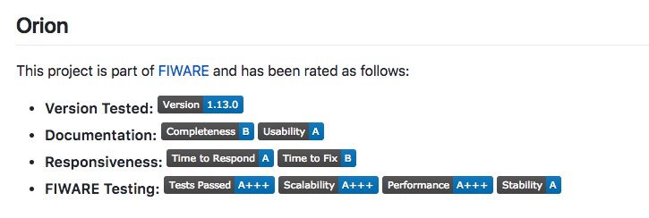
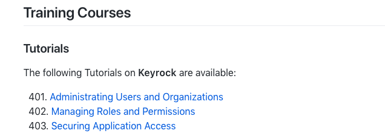
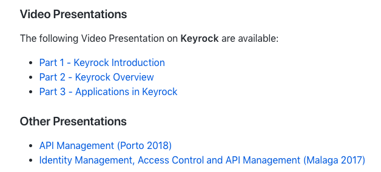

### Badges

This document is a recommendation on the usage of badges in FIWARE Projects.
Badges are small graphical labels which provide a visual aid to understand
different aspects about a project. Badges can be easily generated by using
[Shields.io](http://shields.io/). Where Shields.io already offers a badge it
should be used in preference to other badges.

GitHub repositories `README.md` **MUST** include the following badges at the
very beginning of the document:

-    -
    **FIWARE Chapter** (Link to https://www.fiware.org/developers/catalogue/ )
    Example:
    `https://nexus.lab.fiware.org/repository/raw/public/badges/chapters/iot-agents.svg` -
    the full link includes the logo.
-    -
    **License** - (Link to the OSS License under the component is offered)
    Example:
    `https://img.shields.io/github/license/telefonicaid/fiware-orion.svg`
    Example: `https://img.shields.io/readthedocs/fiware-orion.svg`
-    - **CII
    Best Practices Badge**
-   - **Docker**
    (pointer to the Docker container at the Docker Hub Repository) Example:
    `https://img.shields.io/docker/pulls/fiware/orion.svg`
-   Optional Support badges (e.g. Stack Overflow) - see below
-   A new line character `<br/>`
-    -
    **Documentation** (pointer to the documentation on readthedocs corresponding
    to the branch) Example:
    `https://img.shields.io/badge/support-askbot-yellowgreen.svg`
-    -
    **GE Status** - to show active support for a repository Example:
    `https://nexus.lab.fiware.org/static/badges/statuses/orion.svg`

GitHub repositories `README.md` **SHOULD** list either of the following support
badges at the beginning of the document (where relevant):

-    -
    **Stack Overflow** tag (pointer to the Stack Overflow support channel)
    Example:
    `https://img.shields.io/badge/tag-fiware--orion-orange.svg?logo=stackoverflow`
-    -
    **Support** (pointer to the support channel, askbot, which can be used to
    get support if Stack Overflow is not used) or alternatively include links to
    other relevant support channels.

The idea being that the first row of badges is informational, the second row
displays the state of the project. The second row of badges should ideally all
be **GREEN** at all times.

```markdown
# Identity Manager - Keyrock

[](https://www.fiware.org/developers/catalogue/)
[](https://opensource.org/licenses/MIT)

[](https://hub.docker.com/r/fiware/idm/)
[](https://stackoverflow.com/questions/tagged/fiware-keyrock)
<br>
[](https://fiware-idm.readthedocs.io/en/latest/)
[](https://travis-ci.org/ging/fiware-idm)
[](https://coveralls.io/github/ging/fiware-idm?branch=master)

```

#### QA Requirements

-   a section within the `README` displaying the GE ratings defined as follows:
    

```markdown
## Orion

This project is part of [FIWARE](http://fiware.org/) and has been rated as
follows:

-   **Version Tested:**
    
-   **Documentation:**
    
    
-   **Responsiveness:**
    
    
-   **FIWARE Testing:**
    
    
    
    
```

(replace `orion` as necessary)

#### Tutorial/Training Requirements

GE's repository `README.md` file **MUST** include a list of relevant training
courses:

-   a section within the `README` displaying links to the relevant
    [Tutorial](learning_materials.md#tutorials) 
-   a section within the `README` displaying links to the relevant
    [Academy Courses](learning_materials.md#academy) 

As an example, **Keyrock** would display links to learning materials as shown:

```markdown
## Training Courses

### Tutorials

The following Tutorials on **Keyrock** are available:

&nbsp; 401.
[Administrating Users and Organizations](https://fiware-tutorials.readthedocs.io/en/latest/identity-management)<br/>
&nbsp; 402.
[Managing Roles and Permissions](https://fiware-tutorials.readthedocs.io/en/latest/roles-permissions)<br/>
&nbsp; 403.
[Securing Application Access](https://fiware-tutorials.readthedocs.io/en/latest/securing-access)<br/>

### Video Presentations

The following Video Presentation on **Keyrock** are available:

-   [Part 1 - Keyrock Introduction](https://www.youtube.com/watch?v=dHyVTan6bUY)
-   [Part 2 - Keyrock Overview](https://www.youtube.com/watch?v=dtKsjGbJ7X)
-   [Part 3 - Applications in Keyrock](https://www.youtube.com/watch?v=pjsl0eHpFww)

### Other Presentations

-   [API Management (Porto 2018)](https://www.slideshare.net/FI-WARE/fiware-global-summit-fiwares-api-management-97030121)
-   [Identity Management, Access Control and API Management (Malaga 2017)](https://www.slideshare.net/FI-WARE/fiware-alvaro-alonso-complete-framework-for-identity-access-control-and-api-management)
```

## Roadmap

```markdown
# {{(Incubated) GE Name}} Roadmap

{{Use this for full member GEs}} This product is a FIWARE Generic Enabler. If
you would like to learn about the overall Roadmap of FIWARE, please check
section "Roadmap" on the FIWARE Catalogue.

{{Use this for Incubated GEs}} This product is an Incubated FIWARE Generic
Enabler. If you would like to learn about the overall Roadmap of FIWARE, please
check section "Roadmap" on the FIWARE Catalogue.

## Introduction

This section elaborates on proposed new features or tasks which are expected to
be added to the product in the foreseeable future. There should be no assumption
of a commitment to deliver these features on specific dates or in the order
given. The development team will be doing their best to follow the proposed
dates and priorities, but please bear in mind that plans to work on a given
feature or task may be revised. All information is provided as a general
guidelines only, and this section may be revised to provide newer information at
any time.

## Short term

The following list of features are planned to be addressed in the short term,
and incorporated in the next release of the product planned for **{{date}}**:

{{bullet list of features/tasks}} - this should be a simple list of features you
plan to address in the given period. Try to be comprehensive as well as short in
the description of each feature (**2 lines max**).

-   {{Feature 1}}

-   {{Feature n}}

{{If the description of a given feature will need more elaboration, please add
the following text after end of the description}}:

"(see more detailed description below)" and then create a subsection below or,
alternatively, refer to issues associated to implementation of the feature:
"(see issueX, issueY, ...)" providing the link for each issue.

### {{Feature n}}

subsections providing more details of selected features if needed - this section
would be needed if you plan to add further details as explained above (and not
do it through references to issues)

## Medium term

The following list of features are planned to be addressed in the medium term,
typically within the subsequent release(s) generated in the next **9 months**
after next planned release:

{{Complete this section following the same structure as described for short term roadmap}}

## Long term

The following list of features are proposals regarding the longer-term evolution
of the product even though development of these features has not yet been
scheduled for a release in the near future. Please feel free to contact us if
you wish to get involved in the implementation or influence the roadmap

{{Complete this section following the same structure as described for short term roadmap}}
```
