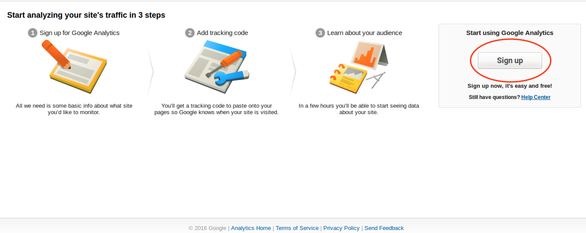
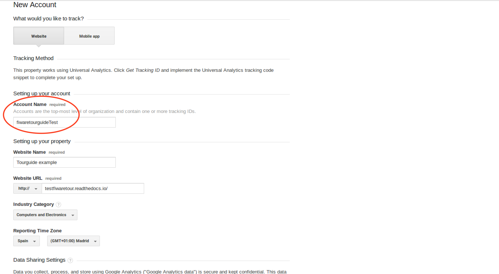
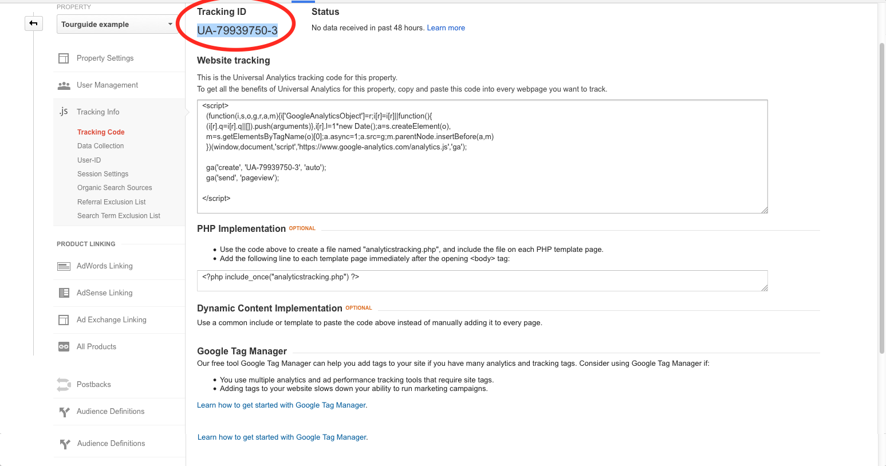
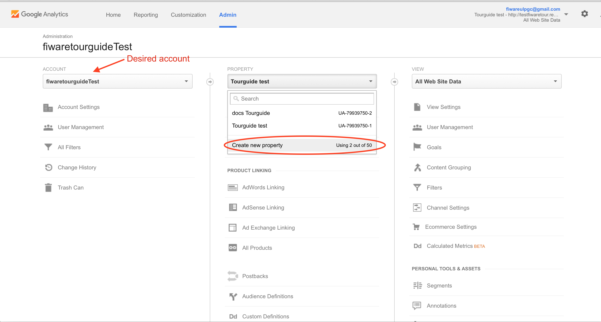
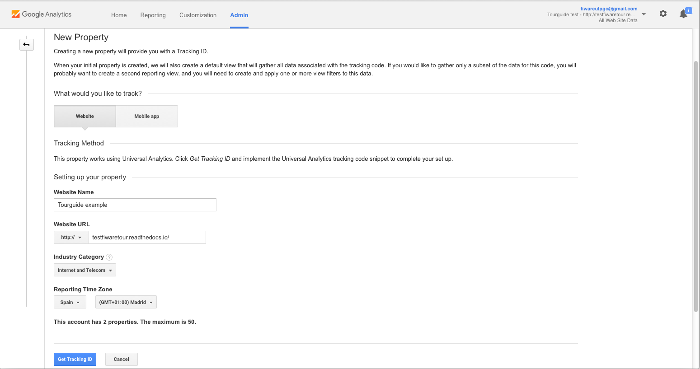
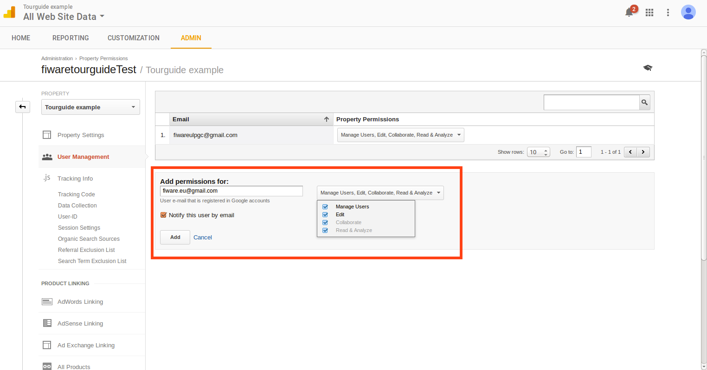
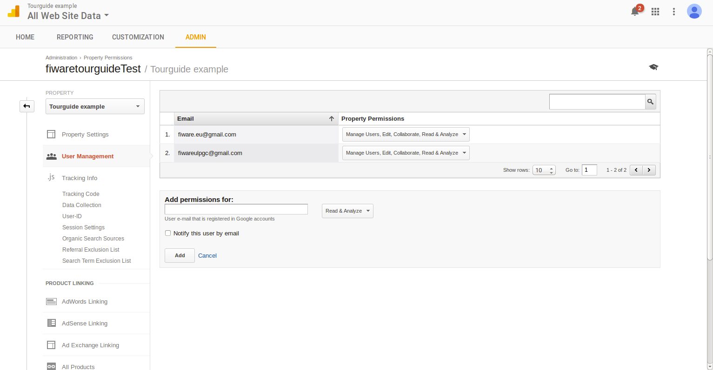

## How to add Google Analytics to Read the Docs

This guide explains how to add Google Analytics to the documentation generated
by Read the Docs and how to set up the Google Analytics to allow access for the
fiware.community account.

### Create a Google Analytics property

Google Analytics properties allow to track web pages visits and other
information. The process for creating a new property differs slightly depending
if you have a Google Analytics account or not.

#### Create new property without having a Google Analytics account

If you don’t have a Google Analytics account, you can create one on
http://analytics.google.com, a Google account is required. Once logged in with
your Google account, you will see a page similar to this :

You need to click on Sign up.

You will directly land on the account creation page. In this page you will also
need to create the new property to be monitored. You should fill the **Account
Name** field with the desired value and, on the **Setting up your property**
section, you should fill the required information:

-   **Site Name**: The name of the page that you are going to monitor.
-   ** site URL**: The URL of the Read the Docs generated site.
-   **Industry Category**: The category of the project.
-   **Reporting Time Zone**: The Time Zone that will be used in the generated
    reports. 

Once all the information is provided, you should click **Get Tracking ID**.

After the creation of the property, it is ready to use. Google Analytics have
some examples of how the property can be used but we will use the Tracking ID
directly. **Annotate the Tracking ID** because it will be used later.

#### Create new property having a Google Analytics account

If you already have a Google Analytics account, from the** Admin** section, with
the desired account selected, you should select “**Create new property**” in the
column named **PROPERTY**.

On the **Create new entity** page you should fill the required information:

-   **Site Name**: The name of the page that you are going to monitor.
-   **Site URL**: The URL of the Read the Docs generated site.
-   **Industry Category**: The category of the project.
-   **Reporting Time Zone**: The Time Zone that will be used in the generated
    reports.

Once all the information is provided, you should click **Get Tracking ID**.

After the creation of the property, it is ready to use. Google Analytics have
some examples of how the property can be used but we will use the Tracking ID
directly.** Annotate the Tracking ID** because it will be used later.

### Provide access to fiware.community account

From the property section, you simply should select **User Management** on the
left menu. Once in the User Management section, you can add the
**fiware.eu@gmail.com** filling the information as can be seen in the image
below. Then simply click on Add. Ensure that the email address is correct, all
permissions are provided and the option **Notify this user by email** is
checked.

If everything was successful, you should view a page like:

### Set up Read the Docs

The easiest way to enable Google Analytics for your documentation is to add the
following line to your **mkdocs.yml** file:

`google_analytics: ['google analytics track ID', 'your site ur']`

An example for the Tourguide should be:

`google_analytics: ['UA-79939750-3', 'fiwaretourguide.readthedocs.io']`

You can follow as example the docs.Tourguide configuration file:
`https://github.com/Fiware/docs.TourGuide/blob/master/mkdocs.yml`

**Note:** You should push the changes to your repository in order to start
tracking your documentation.
