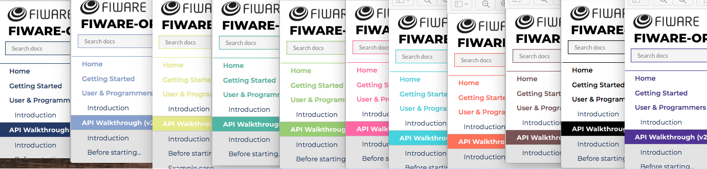

# FIWARE Project Badges

This document is a recommendation on the usage of badges in FIWARE Projects.
Badges are small graphical labels which provide a visual aid to understand
different aspects about a project. Badges can be easily generated by using
[Shields.io](http://shields.io/). Where Shields.io already offers a badge it
should be used in preference to other badges.

This recommendation describes two kind of guidelines for badges: **MUST**
(mandatory), **SHOULD**(desirable) and **MAY** (optional).

GitHub repositories `README.md` **MUST** include the following badges at the
very beginning of the document:

-    -
    **FIWARE Chapter** (Link to https://www.fiware.org/developers/catalogue/ )
    Example:
    `https://nexus.lab.fiware.org/repository/raw/public/badges/chapters/iot-agents.svg` -
    the full link includes the logo.
-    -
    **License** - (Link to the OSS License under the component is offered)
    Example:
    `https://img.shields.io/github/license/telefonicaid/fiware-orion.svg`
    Example: `https://img.shields.io/readthedocs/fiware-orion.svg`
-   - **Docker**
    (pointer to the Docker container at the Docker Hub Repository) Example:
    `https://img.shields.io/docker/pulls/fiware/orion.svg`
-    -
    **Stack Overflow** tag (pointer to the Stack Overflow support channel)
    Example:
    `https://img.shields.io/badge/tag-fiware--orion-orange.svg?logo=stackoverflow`
-    -
    **Support** (pointer to the support channel, askbot, which can be used to
    get support if Stack Overflow is not used)
-   A new line character ` `
-    -
    **Documentation** (pointer to the documentation on readthedocs corresponding
    to the branch) Example:
    `https://img.shields.io/badge/support-askbot-yellowgreen.svg`
-   ![ ](https://img.shields.io/badge/status-Full%20Member-brightgreen.svg?&label=GE%20status&logo=data:image/png;base64,iVBORw0KGgoAAAANSUhEUgAAABsAAAAVCAYAAAC33pUlAAAABHNCSVQICAgIfAhkiAAAA8NJREFUSEuVlUtIFlEUx+eO+j3Uz8wSLLJ3pBiBUljRu1WLCAKXbXpQEUFERSQF0aKVFAUVrSJalNXGgmphFEhQiZEIPQwKLbEUK7VvZrRvbr8zzjfNl4/swplz7rn/8z/33HtmRhn/MWzbXmloHVeG0a+VSmAXorXS+oehVD9+0zDN9mgk8n0sWtYnHo5tT9daH4BsM+THQC8naK02jCZ83/HlKaVSzBey1sm8BP9nnUpdjOfl/Qyzj5ust6cnO5FItJLoJqB6yJ4QuNcjVOohegpihshS4F6S7DTVVlNtFFxzNBa7kcaEwUGcbVnH8xOJD67WG9n1NILuKtOsQG9FngOc+lciic1iQ8uQGhJ1kVAKKXUs60RoQ5km93IfaREvuoFj7PZsy9rGXE9G/NhBsDOJ63Acp1J82eFU7OIVO1OxWGwpSU5hb0GqfMydMHYSdiMVnncNY5Vy3VbwRUEydvEaRxmAOSSqJMlJISTxS9YWTYLcg3B253xsPkc5lXk3XLlwrPLuDPKDqDIutzYaj3eweMkPeCCahO3+fEIF8SfLtg/5oI3Mh0ylKM4YRBaYzuBgPuRnBYD3mmhA1X5Aka8NKl4nNz7BaKTzSgsLCzWbvyo4eK9r15WwLKRAmmCXXDoA1kaG2F4jWFbgkxUnlcrB/xj5iHxFPiBN4JekY4nZ6ccOiQ87hgwhe+TOdogT1nfpgEDTvYAucIwHxBfNyhpGrR+F8x00WD33VCNTOr/Wd+9C51Ben7S0ZJUq3qZJ2OkZz+cL87ZfWuePlwRcHZjeUMxFwTrJZAJfSvyWZc1VgORTY8rBcubetdiOk+CO+jPOcCRTF+oZ0okUIyuQeSNL/lPrulg8flhmJHmE2gBpE9xrJNkwpN4rQIIyujGoELCQz8ggG38iGzjKkXufJ2Klun1iu65bnJub2yut3xbEK3UvsDEInCmvA6YjMeE1bCn8F9JBe1eAnS2JksmkIlEDfi8R46kkEkMWdqOv+AvS9rcp2bvk8OAESvgox7h4aWNMLd32jSMLvuwDAwORSE7Oe3ZRKrFwvYGrPOBJ2nZ20Op/mqKNzgraOTPt6Bnx5citUINIczX/jUw3xGL2+ia8KAvsvp0ePoL5hXkXO5YvQYSFAiqcJX8E/gyX8QUvv8eh9XUq3h7mE9tLJoNKqnhHXmCO+dtJ4ybSkH1jc9XRaHTMz1tATBe2UEkeAdKu/zWIkUbZxD+veLxEQhhUFmbnvOezsJrk+zmqMo6vIL2OXzPvQ8v7dgtpoQnkF/LP8Ruu9zXdJHg4igAAAABJRU5ErkJgggA=) -
    **GE Status** - to show active support for a repository Example:
    `https://nexus.lab.fiware.org/static/badges/statuses/orion.svg`

GitHub repositories `README.md` **SHOULD** include additional badges to display
the commitment of the maintainers to high code standards - the following badges
are suggested (others may also be suitable):

-   - **Travis-CI** or
    equivalent CI Build (pointer to the tests being run) Example:
    `https://img.shields.io/travis/Fiware/dataModels.svg`
-    -
    **Coveralls** or equivalent Coverage tools Example:
    `https://img.shields.io/coveralls/github/jekyll/jekyll.svg`
-    - **Sync**
    or equivalent security tools for known vulnerabilities Example:
    `https://snyk.io/test/github/zaproxy/zap-api-java`

The repository's `README.md` badges, where present, **MUST** appear in the
following order:

-   FIWARE Chapter
-   License
-   Docker
-   Stack Overflow
-   Other Support Channels (if provided)
-   `  - new line character
-   Documentation
-   Build Status
-   Coverage
-   Vulnerabilities
-   GE Status

The idea being that the first row of badges is informational, the second row
displays the state of the project. The second row of badges should ideally all
be **GREEN** at all times.

GitHub repositories **MAY** include, among others, badges for:

-   Information about mandatory runtimes and versions to run the project (node,
    npm, python, pypi, etc.)
-   Any badge relevant specifically for the project.

Should you have any doubt please check
`http://github.com/telefonicaid/fiware-orion/README.md` and its raw content.

If a project's documentation uses the standard FIWARE CSS, the repository's
`docs/index.md` - being the opening page of the documentation, **MUST** contain
equivalent linked badges in the following order:

-   **FIWARE Chapter** (Link to https://www.fiware.org/developers/catalogue/ )
-   **Support** (pointer to the support channel)

## FIWARE Chapter Colors and Badges

)

The following standard FIWARE Colors and badges and **ReadtheDocs** CSS
**SHOULD** be used the various types of documentation produced

-   `#000000` - Black. - Non Chapter specific documentation
-   `#233c68` - Midnight Blue - Core Context Chapter
    `https://img.shields.io/badge/FIWARE-Core-233c68.svg`
-   `#51b6a3` - Elm (Dark Cyan) - Publication /Monetizisation
    `https://img.shields.io/badge/FIWARE-Data_Publication-51b6a3.svg`
    `https://img.shields.io/badge/FIWARE-Data_Monetization-51b6a3.svg`
-   `#45d3dd` - Cyan. - IoT Agents/ Robots / Third Party Systems
    `https://img.shields.io/badge/FIWARE-IoT_Agent-45d3dd.svg`
    `https://img.shields.io/badge/FIWARE-Robots-45d3dd.svg`
-   `#ff7059` - Red - Security / API Management
    `https://img.shields.io/badge/FIWARE-Security-ff7059.svg`
-   `#88a1ce` - Steel - Processing/Visualization/Analysis Chapter
    `https://img.shields.io/badge/FIWARE-Processing/Analysis-88a1ce.svg`
    `https://img.shields.io/badge/FIWARE-Visualization-88a1ce.svg`
-   `#4f3495` - Purple - Media Streams
    `https://img.shields.io/badge/FIWARE-Media_Streams-4f3495.svg`

The following colors are reserved for future use:

-   `#99cd74` - Green
-   `#785356` - Chocolate
-   `#ff68a5` - Pink

Each Document that needs to be published in the FIWARE CSS style **MUST** use
the following CSS styles:

-   `fiware_readthedocs.css` - Black. - Non Chapter specific documentation
-   `fiware_readthedocs_core.css` - Midnight Blue - Core Context
-   `fiware_readthedocs_publication.css` - Elm (Dark Cyan) - Publication
    /Monetizisation
-   `fiware_readthedocs_iot.css` - Cyan. - IoT Agents/ Robots / Third Party
    Systems
-   `fiware_readthedocs_security.css` - Red - Security / API Management
-   `fiware_readthedocs_processing.css` - Steel -
    Processing/Visualization/Analysis Chapter
-   `fiware_readthedocs_media_streams.css` - Purple - Media Streams
