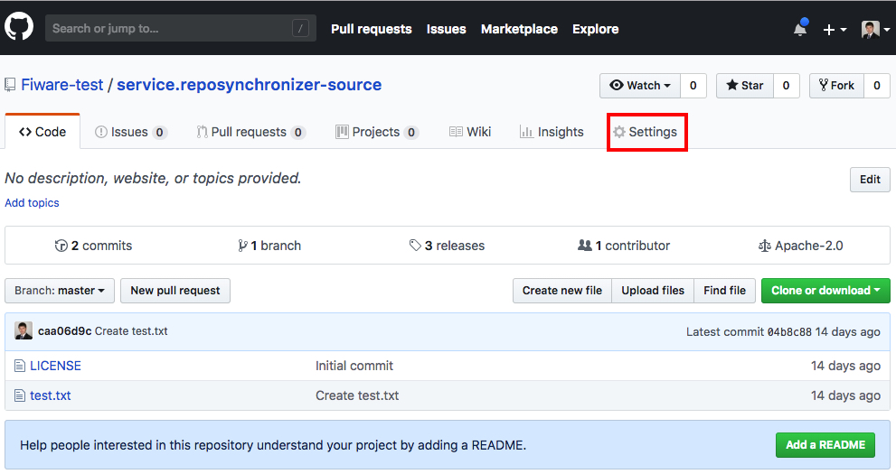
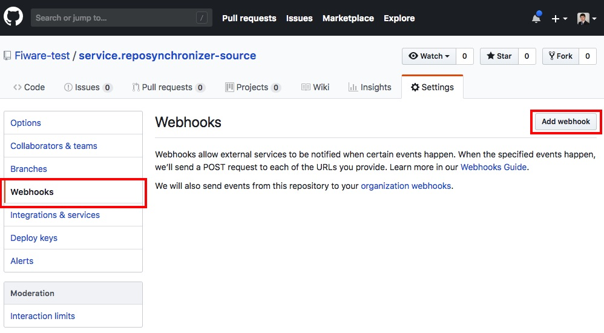
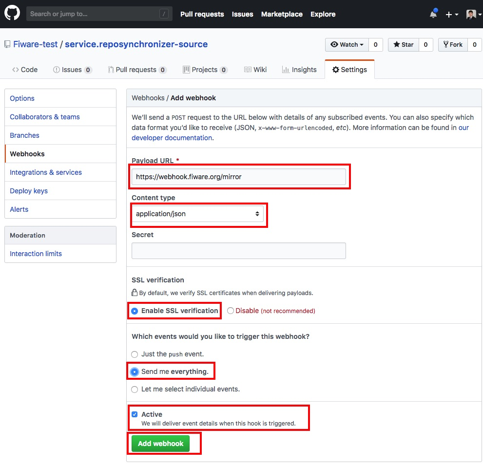
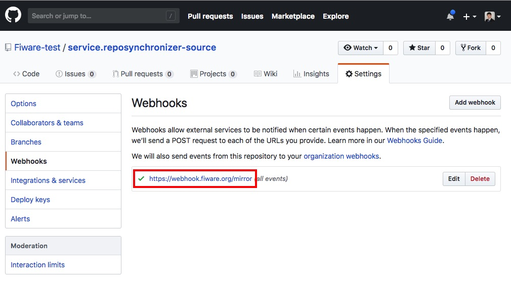
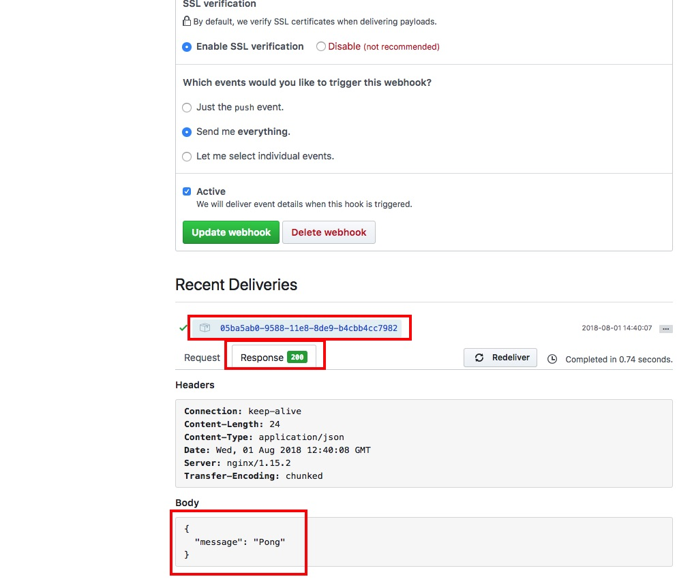

## Configuring webhook in a FIWARE GitHub repository

According to the [mission statement](https://www.fiware.org/foundation/) of the FIWARE Foundation, the foundation
promotes FIWARE related assets across several locations, such as [fiware.org](http://fiware.org),
[Read the Docs](https://readthedocs.org/) and [GitHub](https://github.com/).

To keep the message on GitHub focused, the FIWARE Foundation restricts the main 
[github.com/FIWARE](https://github.com/fiware/) account to assets (such as Data Models, Specifications and Tutorials) 
owned by the FIWARE Foundation itself. For the FIWARE Generic Enablers, mirror copies of the source code are 
hosted under a separate [github.com/FIWARE-GEs](https://github.com/fiware-ges) account in order to maintain 
infrastructure, QA and statistics. Creating a mirror for each repository is required as part of the incubation 
process.

In order to connect your repository with the mirror a webhook is configured. You simply have to follow these steps:

-   In your repository page, click **Settings**.

-   Once you are in the Settings page, click on **Webhooks** menu and then in the button **Add webhook**.

-   Fill in the form:

    -   **Payload URL** - `https://webhook.fiware.org/mirror`.
    -   **Content type** - `application/json`.
    -   **SSL verification** - **Enable SSL verification**.
    -   **Events** - **Send me everything**.

-   Open webhook.

-   Check status code and reply.

